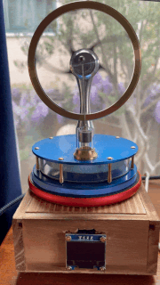
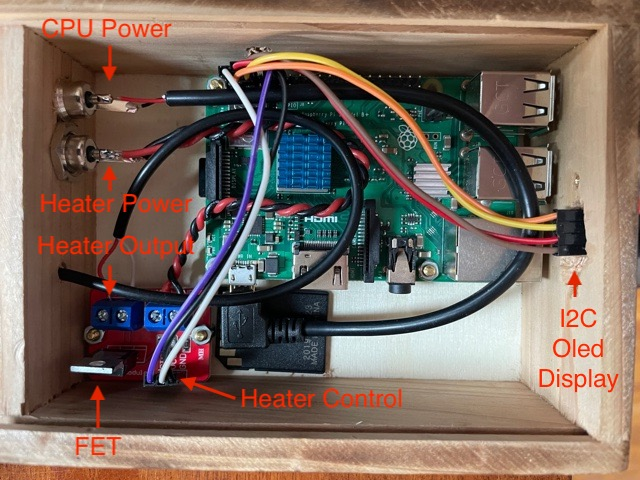

# Data-Driven Stirling Engine



This project shows how to control the speed of a [stirling engine](https://en.wikipedia.org/wiki/Stirling_engine) based on live data. It uses a Raspberry Pi to retrieve data from any of several data sources, and then uses [pulse width modulation](https://en.wikipedia.org/wiki/Pulse-width_modulation) (PWM) to control the temperature of a small heater placed under the stirling engine.

## Ingredients

1. **A Raspberry Pi** - I used a 3B+ but pretty much anything will work.
1. **A Stirling Engine** - The more sensitive, the better. I used one of [these](https://www.stirlingengine.co.uk/d.asp?product=KS90_BLU_KIT) which are long-lasting and well made.
1. **A Heater** - My Stirling engine is about the diameter of a coffee cup, so I used a [USB coffee cup heater](https://www.amazon.com/gp/product/B08MCZ78MY). This has the advantage of running at 5V, which means I could use the same power source as the Raspberry Pi (with some limitations--see below).
1. **A Transistor** - The Raspberry Pi can't provide enough current to drive the heater directly, so we'll need a [FET](https://en.wikipedia.org/wiki/Field-effect_transistor). I had [one of these](https://www.amazon.com/gp/product/B07GLNCRR4) lying around, which have nice terminals for hooking up the Raspberry Pi's GPIO pins, the heater power supply, and the heater itself, but if you're up for soldering you could use just about anything here.
1. **A Power Supply** - Since both the Raspberry Pi and the heater are powered by 5V, I just used a [dual-output USB wall wart](https://www.amazon.com/gp/product/B07DFWKBF7). _IMPORTANT_: make sure the outputs are isolated or each time the heater comes on the RPi will see a voltage drop and reset.
1. **Wires, Connectors, etc** - You'll need a way to connect your project to the power supply, and hookup wires to connect the GPIO pins to the FET.

### Optional

1. **A Display** - I wired up a small I2C driven OLED display. Haven't figured out what to do with it.
1. **A Thermal Pad** - I cut one of [these](https://www.amazon.com/gp/product/B085VSJFY7) to match the bottom plate of the Stirling engine and put on top of the heater to ensure good thermal transfer. Also it keeps things from sliding around.
1. **A Project Box** - I used a wood box I had lying around.

## Assembly



| Physical Pin | Logical Pin | Connect To     |
| ------------ | ----------- | -------------- |
| 2            | 5V          | FET Vcc        |
| 3            | SDA         | Display SDA    |
| 4            | 5V          | Display Vcc    |
| 5            | SCL         | Display SCL    |
| 6            | Ground      | Display Ground |
| 9            | Ground      | FET Ground     |
| 12           | GPIO 18     | FET Signal     |

### Assembly Notes

- You could also use GPIO pin 1 (3.3V) for the FET VCC.
- Make sure your heater and Raspberry Pi power lines are isolated or you risk resetting the RPi if the voltage drops when the heater comes on.

## Setup

### Install an operating system

There are a ton of tutorials out there for getting a Raspberry Pi up and running so we won't go over that here. I used [Raspberry Pi OS Lite](https://www.raspberrypi.org/software/operating-systems/#raspberry-pi-os-32-bit) for this project but any distro capable of running nodejs applications will work.

Make sure you [set up WiFi and enable SSH](https://www.raspberrypi.org/documentation/remote-access/ssh/README.md) and can SSH into your Raspberry Pi.

### Install tooling

Once you've got your OS set up you'll need to install a few tools. SSH into your Raspberry Pi and install the following:

1. **NodeJS and NPM** - Tutorial [here](https://medium.com/@thedyslexiccoder/how-to-update-nodejs-npm-on-a-raspberry-pi-4-da75cad4148c).
1. **Git** - Tutorial [here](https://linuxize.com/post/how-to-install-git-on-raspberry-pi/)
1. **Yarn** - Not strictly needed, but faster than NPM. Instructions [here](https://classic.yarnpkg.com/en/docs/install).

### Clone this repo and install dependencies

You can put this application anywhere. I put it into `/home/pi` like so:

```bash
git clone https://github.com/baspete/stirling-pi.git
```

and then set it up like so:

```bash
cd stirling-pi
yarn install
```

### Edit app.js and update the data source(s)

(There's a super-handy VS Code plugin called [Remote - SSH](https://github.com/Microsoft/vscode-remote-release) that you can use to edit code on your Raspberry Pi from VS Code.)

Open the `app.js` file in your editor and look a the "CONFIGURATION" section. It should look something like this:

```javascript
const duty = [0.1, 0.8];

// Length (ms) of each PWM interval.
const pwmInterval = 2000;

// Heater control pin.
const heaterPin = 18; // physical pin 12

// Data sources, parameter to measure, initial min/max guesses etc
const sources = {
  wind: {
    url: `https://swd.weatherflow.com/swd/rest/observations/station/40983?token=${process.env.TOKEN}`,
    param: 'wind_gust',
    minMax: [0, 20],
    historyLength: 5, // super noisy
    dataInterval: 1,
  },
  aircraft: {
    url: 'http://192.168.1.5/dump1090-fa/data/aircraft.json',
    param: 'flight',
    minMax: [10, 100],
    historyLength: 1, // not noisy
    dataInterval: 1,
  },
};
```

Edit this section, keeping the following in mind:

- **duty** - This is an array with min and max possible PWM duty cycles. Set the first number just high enough to keep the Stirling engine spinning at idle. If you set this too low the Stirling engine will stop spinning and you'll need to give it a push to get it going again. Set the high number at or below 1.0. In my case I found that anything above 0.8 spun the Stirling engine like a monkey on crack.
- **pwmInterval** - This is the length of a single PWM interval in milliseconds. The heater/Stirling engine combination has a fair amount of thermal and physical inertia, so you can set this to a few seconds. 2000ms is fine.
- **heaterPin** - Set this to whatever you used for the FET signal. Note that this is the logical pin, not the physical pin.

For `sources` I'm showing examples based on my [FlightAware ADS-B receiver](https://flightaware.com/adsb/piaware/) and my [Weatherflow Tempest weather station](https://weatherflow.com/tempest-weather-system/). Here's what those parameters mean:

- **url** - where to get the data.
- **param** - what parameter to measure. See the note below about the `getData()` function.
- **minMax** - an array with the minimum and maximum expected values for `param`. Start with some conservative numbers here; over time the app will adjust these outward as needed. Note that with no persistent storage this will reset anytime your program restarts.
- **historyLength** - If you set this to greater then 1, the program will use a running average of this many historical measurements to smooth noisy data.
- **dataInterval** - How often (in minutes) to retrieve new data.

#### Note about sources

The `getData()` function has a `switch` statement for parsing data based on the different data sources. Make sure you edit this as needed to parse the data your data source returns. Yeah, this could be better.

#### Environment Variables

If you put a file called `.env` in the root of your application, the `dotenv` library will grab any values out of it and put them into the Nodejs environment at runtime. This allows you to keep sensitive information out of your source code (this file is ignored by git). Here's what I put in mine:

```
TOKEN=blah-blah-blah
TYPE='aircraft'
```

These envionment variables can then be read in your code as `process.env.TOKEN` and `process.env.TYPE`. Note that if you choose not to do this you'll need to update the value for `dataType` in the `app.js` STARTUP block.

## Usage

You can test your application by typing

```
node app.js
```

If everything is working you'll see some logging info in the console. If you've properly set the values in the `duty` array, in a minute or two the heater should be warm enough to keep the Stirling engine spinning. Give the flywheel a push and it should keep going.

As your Raspberry Pi updates data based on what you've put in `sources` the PWM duty cycle will change accordingly, changing the amount of heat going into your Stirling engine.

### Starting automatically

You can use the fantastic [PM2](https://pm2.keymetrics.io/docs/usage/quick-start/) to automatically start your app when you power up the Raspberry Pi.

1. Install pm2 globally with `sudo npm install -g pm2`
2. With your app stopped, go to your app directory and type `pm2 start app.js`. Verify that your app is running with `pm2 ls`.
3. Set up the boot strategy by typing `pm2 startup`. This will configure your Operating System's boot service as needed to start your app when it boots up.
4. Type `pm2 save` to save the process list for automatic respawn.

That's it. Now your app will start up automatically anytime you power up your RPi. You can monitor your app and see log output with `pm2 monit`.
